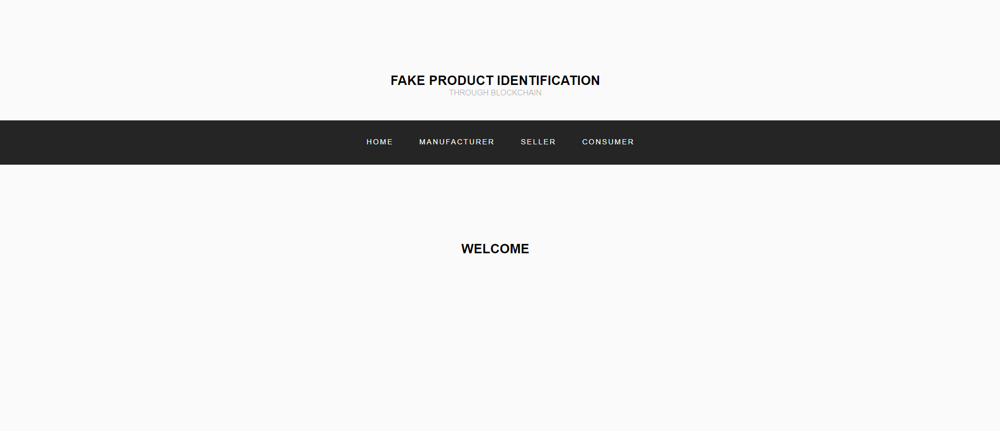
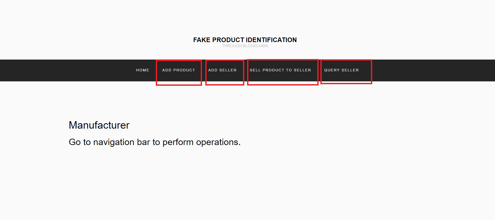
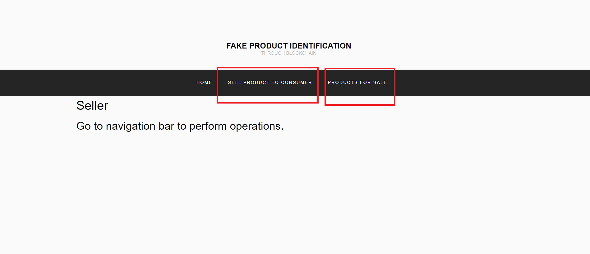
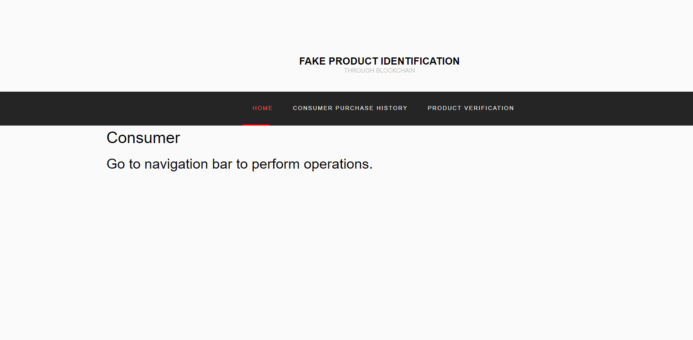
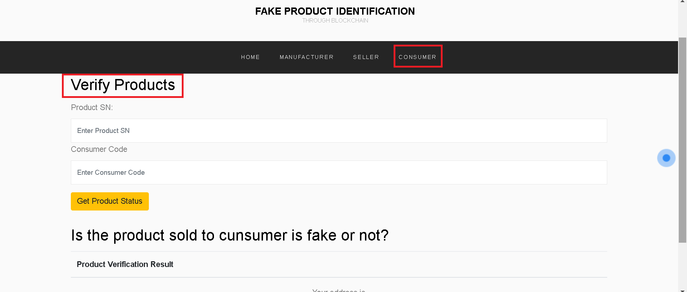
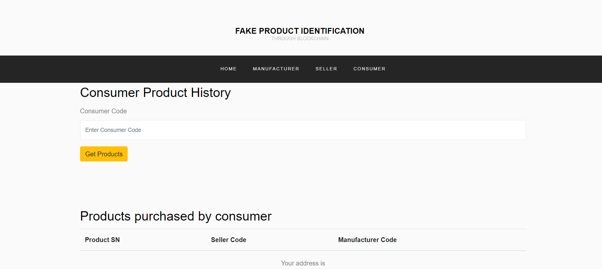
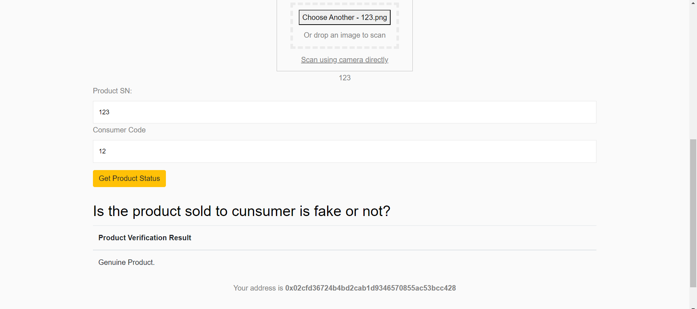
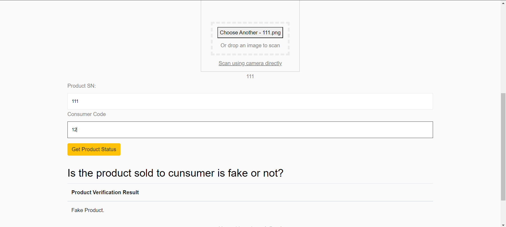
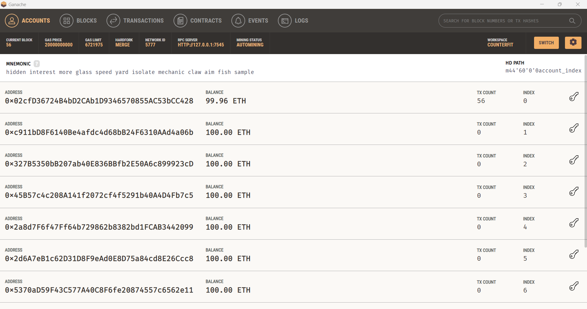

# 🔗 Blockchain Based System to Detect Counterfeit Products in Supply Chain  

This project implements a **blockchain-based solution** to detect and prevent **counterfeit products** in the supply chain.  
By leveraging **Ethereum blockchain, smart contracts, and decentralized validation**, the system ensures that every product is verified at each step in the supply chain — from manufacturer to customer.  

---

## 🛠️ Tech Stack  

<p align="left">
  
  
  
  
  
  
  
  
</p>

---

## ✨ Features  

- ✅ **Blockchain Security** – Each transaction is validated and stored on Ethereum blockchain.  
- ✅ **Product Verification** – Customers can check authenticity via blockchain records.  
- ✅ **Smart Contracts** – Ensure tamper-proof records for supply chain operations.  
- ✅ **Integration with MetaMask** – For transaction signing and account management.  
- ✅ **Ganache Local Blockchain** – For testing blockchain operations in development.  
- ✅ **Web Interface** – Developed using HTML, CSS, JavaScript for easy interaction.  

---

## 📐 System Workflow  

1. **Manufacturer** registers a product on the blockchain.  
2. Each **supply chain participant** (distributor, retailer) updates product status.  
3. **Blockchain ledger** stores all transactions immutably.  
4. **Customer** scans/verifies product authenticity at purchase.  


---

## 🚀 Getting Started (Local Setup)  

### 🔧 Prerequisites  
- Node.js installed  
- XAMPP installed  
- MetaMask browser extension  
- Ganache (for local Ethereum blockchain)  

### ⚙️ Steps to Run Locally  

1. Clone this repository:  
```bash
   git clone https://github.com/yourusername/Blockchain-based-system-to-detect-counterfeit-products-in-supply-chain.git
```

2. Navigate to project directory:
```bash
cd Blockchain-based-system-to-detect-counterfeit-products-in-supply-chain
```

3. Install dependencies:
```bash
npm install
```
4. Start Ganache and configure the Ethereum blockchain.

5. Connect MetaMask to the local Ganache blockchain.

6. Compile smart contract & Run the backend:
```bash
truffle Compile
truffle migrate
npm run dev
```

7. Open the frontend (index.html) in a browser.


## 📸 Screenshots  

### 
  

### 
  

### 
  

### 
  

### 
  

### 
  

### 
  

### 
  

### 
  

